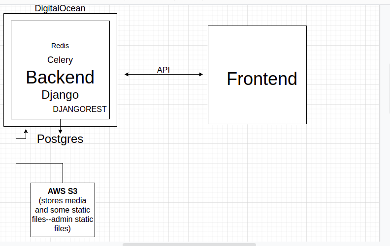

# Question 1

## i)API

Application Programming Interface (API) is the most common tool for connecting different applications. There are many different types of API that are either public, partner, or private. What they all have in common is how they enable interaction between applications. An API uses a common code language to specify functionality and set protocols. This gives your applications the ability to transfer data.

## Installation

Use the package manager [pip](https://pip.pypa.io/en/stable/) to install requests.

```bash
pip install requests
```

## Usage

```python
import requests

response = requests.get("https://api.open-notify.org/this-api-doesnt-exist")
print(response.status_code)
```


## ii)WEBHOOKS

Webhooks or HTTP callbacks are an alternative to APIs. They are quite similar in that they are tools that link to a web application. But, they have two key differences. For webhooks, implementation is often not code-based. They often have modules that are programmable within a web application. Instead of being request-based, webhooks are event-based. They only trigger when specific events occur within a third-party service.

## Usage

```python
from webhooks import webhook
from webhooks.senders import targeted

@webhook(sender_callable=targeted.sender)
def basic(url, wife, husband):
    return {"husband": husband, "wife": wife}

r = basic(url="http://httpbin.org/post", husband="Danny", wife="Audrey")
import pprint
pprint.pprint(r)

{'attempt': 1,
'hash': '29788eb987104b8a87d201292fa459d9',
'husband': 'Danny',
'response': b'{\n  "args": {},\n  "data": "",\n  "files": {},\n  "form": {\n    "attempt": "1",\n    "hash": "29788eb987104b8a87d201292fa459d9",\n    "husband": "Danny",\n    "url": "http://httpbin.org/post",\n    "wife": "Audrey"\n  },\n  "headers": {\n    "Accept": "*/*",\n    "Accept-Encoding": "gzip, deflate",\n    "Connection": "close",\n    "Content-Length": "109",\n    "Content-Type": "application/x-www-form-urlencoded",\n    "Host": "httpbin.org",\n    "User-Agent": "python-requests/2.3.0 CPython/3.3.5 Darwin/12.3.0",\n    "X-Request-Id": "d25119e4-08ba-4523-abc4-b9a9ac10225b"\n  },\n  "json": null,\n  "origin": "108.185.146.101",\n  "url": "http://httpbin.org/post"\n}',
'status_code': 200,
'url': 'http://httpbin.org/post',
'wife': 'Audrey'}
```

## iii)ISC

Unlike code-based integrations, an Integration Services Component (ISC) lives on a local server. The ISC creates a bridge with on-premise tools such as directories, asset management tools, and BI tools without the need for file imports.

## iv)ORCHESTRATION
The most automated integration option is orchestrations. If you are not familiar with orchestrations, they refer to the process of automating multiple systems and services together. Teams will often use software configuration management tools such as PowerShell to build orchestrations. Software configuration management tools offer various methods such as snap-ins or hosting APIs to connect with applications to manage the automation workflow.


# Question 2
Storage of data is crucial in this situation.There's a wide range of storage solutions and different use-cases require different types of storage.On servers, if the data you're keeping track of is only useful during a session of that server, then it makes sense to keep it in Memory. This is much faster and less expensive than writing things to a persistent database.For example, a single session may mean when a user is logged in and using your site. After they log out, you may not need to hold on to bits of data that you collected during the session.But whatever you do want to hold on to (like shopping cart history) you will put in persistent Disk storage. That way you can access that data the next time the user logs in, and they will have a seamless experience.
Factors to consider are:
* the shape (structure) of your data, or
* what sort of availability it needs (what level of downtime is OK for your storage), or
* scalability (how fast do you need to read and write data, and will these reads and writes happen concurrently (simultaneously) or sequentially) etc, or
* consistency - if you protect against downtime using distributed storage, then how consistent is the data across your stores?

Latency is another thing to consider ie the measure of a durationfor an action to complete something or produce a result.
Caching. This is a very fundamental technique to speed up performance in a system.  Thus caching helps to reduce latency in a system.

Databases to use:
* Key-Value eg Redis. A set of unique keys that point to some value. Data is held in the machines memory as opposed to other databases that keep data on their disk. This limits the amount of data you can store but makes a database reakky fast because it doesn't require a round-trip to the disk for every operation. It is best used for caching for it's real time delivery of data.
* Relational Database like Postgres
Celery will be used to handle asynchronous tasks




# Question 3
Hashing is a key part of most programming languages. Large amounts of data can be represented in a fixed buffer. Key-value structures use hashes to store references.
Hashes are used to secure. Hashes can be deterministic or non-deterministic. Hashes can be significantly different with small changes to data or very similar.

## i)Built-In Hashing
Python provides the built-in ```.hash()``` function as shown below.

```bash
>>> hash("test")
5946494221830395164
```

## ii)Checksums
Checksums are used to validate data in a file. ZIP files use checksums to ensure a file is not corrupt when decompressing. Unlike Python’s built-in hashing, it’s deterministic. The same data will return the same result each time. Example of alder32 below.

```bash
>>> import zlib
>>> zlib.adler32(b"test")
73204161
>>> zlib.crc32(b"test")
3632233996
```

## iii)Secure Hashing(two way)
eg MD5. Each method grows in size, improving security and reducing the risk of hash collisions. A collision is when two different arrays of data resolve to the same hash.

```bash
>>> import hashlib
>>> hashlib.md5(b"test1").hexdigest()
'5a105e8b9d40e1329780d62ea2265d8a'
>>> hashlib.md5(b"test2").hexdigest()
'ad0234829205b9033196ba818f7a872b'
```

